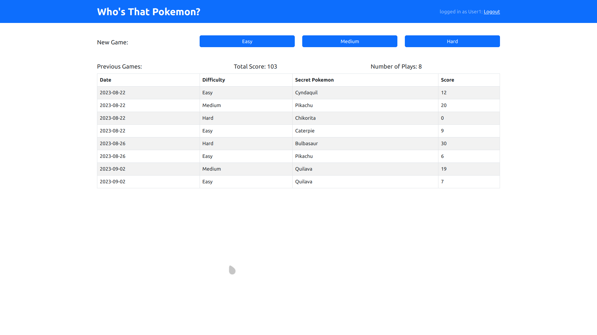
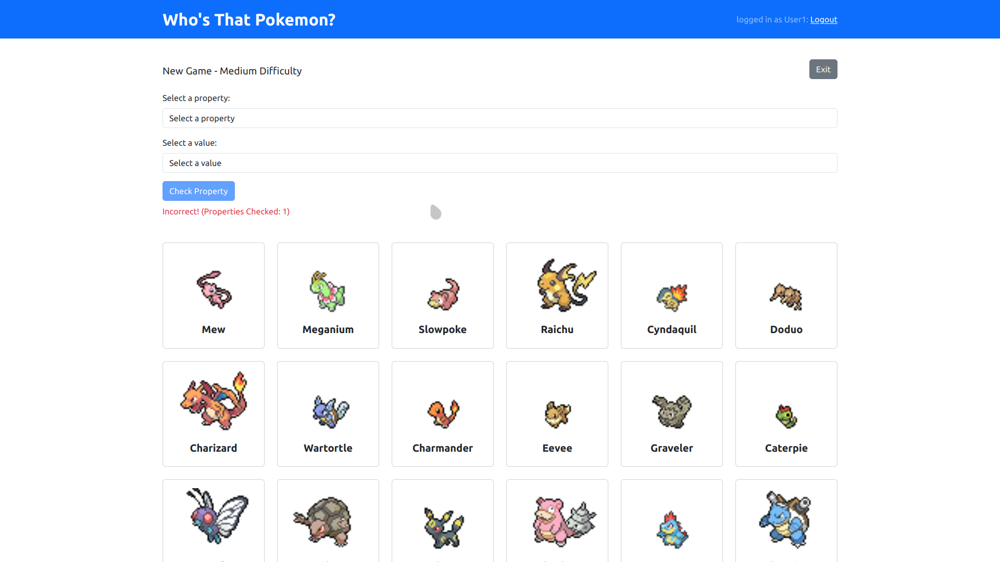
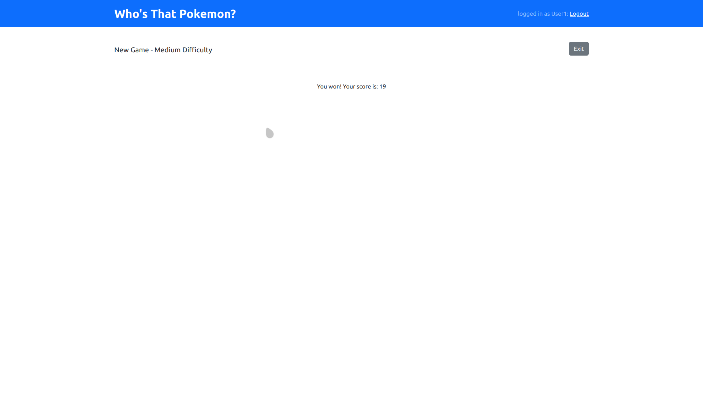

# Exam #3: "INDOVINA CHI"

**Score of the project : 30L/30**

Simple Guess-Who web application developed for the course "Applicazioni Web I" at Politecnico di Torino.

## React Client Application Routes

- Route `/`: front page with options to start a new game and old plays table for logged users
- Route `/play`: current play page with form to check properties and grid of pokemon
- Route `/loing`: login page

## API Server

- POST `/api/session` : login
- GET `/api/session/current` : logout
- DELETE `/api/session/current` : check if logged in
- GET `/api/plays` : AUTHENTICATED, retrieves all old plays
- DELETE `/api/plays/:playid` : delete a record from database when a game is canceled or finished without being authenticated
- POST `/api/start-game` : starts a new game by creting entry in the database, choosing a subset of pokemon and the secret one. Example body:

  ```json
  {
    "difficulty": 1
  }
  ```

- PUT `/api/check-property` : check if a property sent by client matches with the secret object. Example body:

  ```json
  {
    "playID": 4,
    "propertyname": "type1",
    "propertyvalue": "grass"
  }
  ```

- PUT `/api/final-guess` : checks if the final score is correct. return the score of the game (0 if wrong guess, >0 if correct guess). Example body:

  ```json
  {
    "playID": 4,
    "guess": "meganium"
  }
  ```

## Database Tables

- Table `users` - contains user login information
- Table `pokemon` - contains the 36 pokemon from which to choose the subsets
- Table `plays`(_playID_,userID,date,difficulty,score,secretpokemoninfo..) - contains games information for all users, they are creted at the start of a new game and updated (score) with each property check

## Main React Components

- `Frontpage` (in `Frontpage.jsx`): front page with buttons to choose a new game difficutly and for logged in users a table showing all past games and cumulative score
- `NewGame` (in `Newgame.jsx`): current game page, contains two drop down menus to choose a property and a vaule to check, belowe has a 2D grid of clickable cards containeing the current game pokemons. Clicking on a card sends the final guess.

## Screenshot





## Users Credentials

- user1@test.com, pwd
- user2@test.com, pwd
- user3@test.com, pwd (no games)
